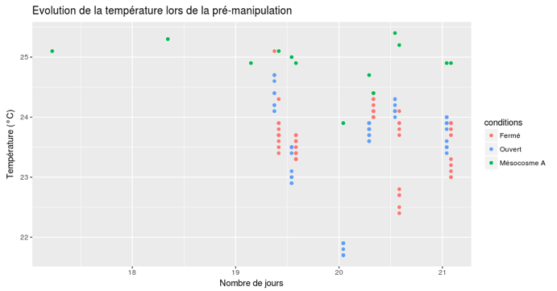
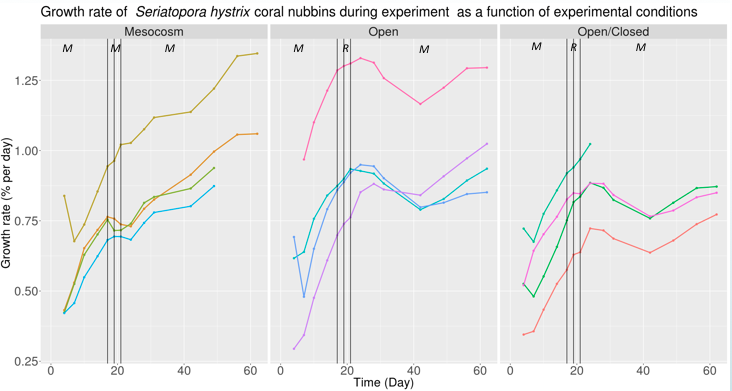
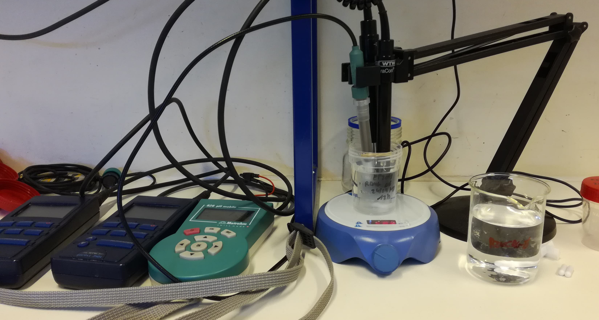
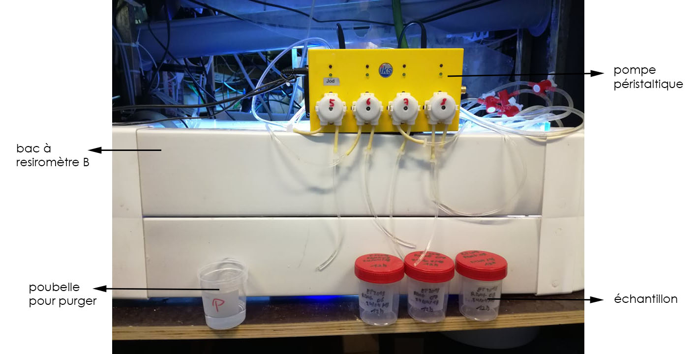
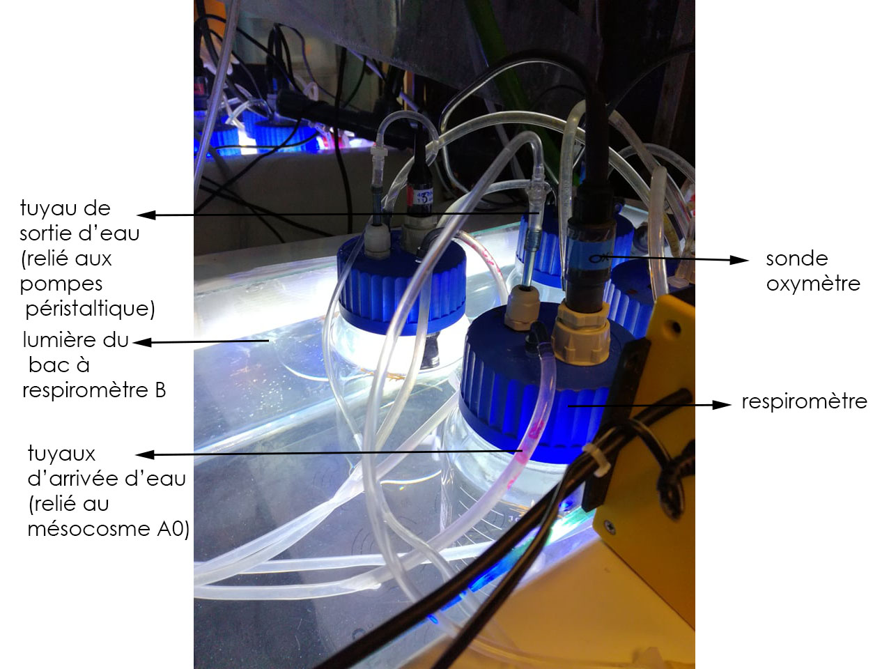

# 1) Introduction

L'écophysiologie est à l'intersection entre l'écologie et la physiologie. C'est une discipline qui étudie de façon quantitative les réactions d'un organisme face aux changements du milieu. L'écophysiologie est donc multidisciplinaire et inclu différentes notions comme l'alimentation, la digestion, la respiration, la croissance, l'éco-toxicologie,...[@intro]

Lors de l'étude d'un organisme en écophysiologie, le plus important est de regarder les flux entrants et sortants, l'anabolisme et le catabolisme, et regarder comment ces flux changent en fonction des paramètres (température, salinité, pH,...).
La plupart des flux ne sont pas mesurables directement. Leur quantification par des proxy est courante en biologie. Un proxy est une variable facilement mesurable et fortement corrélée avec le paramètre étudié. Lors d'une étude sur la respiration par exemple les proxy pouvant être utilisés sont la consommation en oxygène ou la production en CO2.

Une autre manière de quantifier les flux est de regarder la croissance somatique de l'individu. Il est pesé à deux moments dans le temps et la différence de masse observée sera une expression directe de sa vitalité.
Enfin, les flux sont également mesurables à l'aide d'isotopes radioactifs et stables mais ceux-ci sont difficilement manipulables et coutent assez cher [@cours].

Dans le cadre de ce stage, deux techniques d'écophysiologie seront appliquées, la mesure de la croissance et la respirométrie. La croissance et la respiration seront mesurées sur des boutures de *Seriatopora hystrix*.

Le but principal des manipulations est l'amélioration du protocole de respirométrie. En effet, lors d'une précédente manipulation au respiromètre plusieurs problèmes sont apparus. Lors de la prise d'échantillons et la mesure des paramètres, une grosse perte de température se marquait entre les différents échantillons car ils étaient prélevés simultanément alors que la prise de paramètres se faisait en différé à cause du temps que prennent les mesures. De plus, il est sorti de ces manipulations que les boutures de coraux subissaient un stress dans le respiromètre, marqué par un plateau de croissance. L'hypothèse de provenance de ce stress est que, lorsque les boutures sont dans les mésocosmes, la source de lumière vient uniquement du haut avec une certaine intensité et lorsqu'elles sont mises dans les respiromètres, l'installation fait qu'elles recoivent cette même intensité lumineuse mais de plusieurs côtés à la fois, ce qui induirait un stress chez les boutures. Un autre objectif de ce stage sera donc de voir si la luminosité influence réellement la croissance en utilisant 2 types de respiromètres, un soumis à une forte intensité lumineuse (A) et l'autre soumis à une intensité lumineuse atténuée (B).

# 2) Techniques d'écophysiologie

## 2.1) Mesure de la croissance

Les boutures ne peuvent pas être mesurées directement sur une simple balance. En effet, en plus du poids de la bouture, il y aurait également celui de l'eau qu'elle contient et cette quantité d'eau est variable. L'erreur faite serait supérieure à la variation de la masse en carbonate de calcium étant donné que les mesures sont quotidiennes. La pesée en immersion, technique plus précise, est donc utilisée. Avec ce type de pesée, la croissance du squelette en carbonate de calcium est directement mesurée. En effet, comme la bouture est dans la masse d'eau, le poids qu'indique la balance est le poids immergé, c'est à dire le poids de la bouture moins le poids du volume d'eau déplacé. Les tissus ont une densité équivalente à celle de l'eau et leur poids est exactement compensé par la poussée d'Archimède[@intro]. 

Lors de pesées aussi précises que les mesures de croissance de boutures de coraux, l'erreur de la balance peut grandement influencer. L'utilisation d'une balance micromètrique permet d'avoir l'erreur la plus faible possible. Afin de se rendre compte de cette erreur, une même bouture est pesée une dizaine de fois. Les résultats varient de + ou - 0.001g. Cette erreur est donc négligeable.

Comme le poids de nos boutures n'est pas le même à la base, l'interprétation de la croissance se fera en relatif (en pourcentage).

Les boutures ont été placées dans le mésocosme A0 le 17/04/2018, elles proviennent à la base du mésocosme B0. La mesure du poids a été effectuée régulièrement à partir de cette date jusqu'au 04/05/2018 (en tout 18 jours). Du 25 au 27/04, 6 boutures(1, 2, 10, 19, 16 et 13) ont été séléctionnées aléatoirement et placées dans les respiromètres.

## 2.2) La respirométrie

Le but de la respirométrie est de monitorer la concentration en oxygène au cours du temps pour avoir une indication sur la respiration d'un organisme. Pour cela, un récipient hermétique (pour ne pas contaminer avec l'oxygène de l'air) est utilisé, dans lequel une sonde à oxygène est plongée[@intro]. Pour éviter que l'organisme ne tombe à court d'oxygène, le respiromètre est relié à une arrivée d'eau et une sortie d'eau. L'eau injectée provient du mésocosme A0 par intermittence à l'aide d'une valve, ce système est couplé à une évacuation de l'eau usée. La concentration en oxygène est ainsi remontée dans le milieu et l'organisme subit un moins gros stress. Le système shifte de position ouverte à fermée et inversement toutes les heures (une heure en position fermée, une heure en position ouverte, une heure en position fermée,...). 
 
Le CO2 n'est pas monitoré car dans l'eau il va réagir en fonction des équilibres acides-bases et un être vivant affecte ces équilibres, ce n'est donc pas assez précis. C'est bien plus facile de travailler avec l'oxygène car il ne rentre quasiment que dans la respiration/photosynthèse [@intro].

Avec ces mesures, un graphique de la concentration en oxygène en fonction du temps sera établi. L'évolution de l'oxygène a été mesurée avec l'IKS [@IKS]. La concentration en oxygène avec l'oxymètre a également été mesurée, lors de la mise en respiromètre et lors du retrait des boutures. Ces deux mesures, début et fin, sont très importantes car elles vont servir à requalibrer la sonde IKS, qui se dérègle au cours du temps. L'idée est de recaler le signal en partant du premier point et d'aller le recaler pour aboutir au point de la fin. En statistique, cela correspond à faire une approximation linéaire entre les deux points. 

# 3) Protocole 

## 3.1) Ancien protocole 

Dans l'ancien protocole, l'expérimentateur prélevait ses échantillons directement aux tuyaux d'évacuation et cela pour tous les échantillons en même temps. Il allait ensuite prendre les paramètres avec les sondes dans les échantillons. 
En plus de n'être pas très propre, cette méthode a l'énorme désavantage d'engendrer une chute des températures entre les échantillons et cette chute provoque une modification des autres paramètres qui y sont corrélés.



Sur cette figure, une chute des températures au cours des mesures est nettement visible. Les mesure réalisées simultanément devraient se superposer, avoir la même température.

Lors de cette ancienne manipulation, un stress sur les boutures a été mis à jour. Ce stress est visible sous forme d'un plateau observable sur le graphique de l'évolution de la croissance.



Des plateaux de croissance sont en effets observables dans l'intervalle de temps où les boutures sont mises en respirométrie. Fait étrange, même les boutures restées en mésocosme présentent un plateau de croissance, le stress pourrait donc ne pas provenir du respiromètre mais d'une autre perturbation du milieu.

## 3.2) Nouveau protocole

L'évolution du poids de 20 boutures est suivit quotidiennement. Les boutures viennent du bac B0 et sont placées dans le A0 où la croissance est normalement plus rapide. Toutes les boutures sont accrochées sur des réglettes en plastique par des fils de nylon et toutes ont subi le même traitement, c'est-à-dire une seule coupe. 

Les boutures sont mises 7 jours dans le mésocosme avant d'aller en respirométrie. Ensuite, 6 boutures sont séléctionnées aléatoirement avec la fonction random de R et mises dans les respiromètres.

Huit respiromètres sont utilisés pour l'expérience. Ils sont séparés par quatre dans deux bacs à respiromètrie différents, le A et le B, réglés à la même température, 25°C. La différence entre les deux bacs est la luminosité. Les respiromètres sont alimentés par l'eau venant du mésocosme A0 et les cycles sont réglés avec une alternance de 1h ouvert/1h fermé. Les boutures sont éclairées de 9h à 21h. Dans chaque bac à respirométrie se trouve 4 respiromètres, 1 vide et 3 contenant une bouture. Le respiromètre vide sert de contrôle négatif. Chaque respiromètre est relié à des sondes.

Les deux bacs à respiromètre sont dans des conditions de luminosité différentes. Les respiromètres B recevront une lumière atténuée par rapport aux respiromètres A. Les respiromètres du bac B sont dit LI pour Low Intensity et les respiromètres du bac A sont dit HI pour High Intentisy. Pour mesurer la quantité de PAR reçue, un quantummètre est utilisé. L'appareil est placé dans le respiromètre rempli d'eau pour calculer ce que le corail devrait recevoir comme intensité lumineuse. Les respiromètres LI recevront moitié moins d'intensité lumineuse, c'est à dire 100 PAR de chaque côté, par rapport au respiromètres HI, qui recoivent 200 PAR de part et d'autre. Les mesures sont réalisées en PAR car cela vise les longueurs d'ondes utiles à la photosynthèse.

Le principale problème de l'ancienne manipulation vient du fait qu'il y a une énorme diminution de température entre le premier et le dernier échantillonnage. 
Pour réduire la perte de température les respiromètres ne sont plus ouverts pour prélever les échantillons. Les prélèvements se font à l'aide de pompes péristaltiques pour éviter au maximum les pertes de température. 
Tous les paramètres sont également pris en même temps en plongeant les sondes dans l'échantillon. Les appareils utilisés sont un pH-mètre [@metrohm] un oxymètre [@oxi] et un conductimètre [@cond]. Avec ce dernier, la température est relevée également. Les échantillons sont placés sur une plaque agitatrice lors de la prise des paramètres pour mélanger chaque échantillon de manière équivalente. Il faut prévoir assez de puces agitatrices afin d'en avoir une par échantillon et ne pas perdre de temps à les nettoyer.

Dans le nouveau protocole, deux étudiants se répartissent les bacs à respirométrie LI et HI. Les 2 étudiants s'alternent tour à tour aux sondes pour prendre les paramètres, puis retournent récolter un échantillon avec les pompes péristaltiques. Cela permet ainsi d'aller plus vite et de réaliser la prise d'échantillons et de paramètres le plus simultanément possible. L'étudiant s'occupant des LI commence par prendre un échantillon directement dans le mésocosme A0 et mesure ses paramètres pendant que l'étudiant chargé des HI récolte un échantillon aux pompes péristaltiques comme ci-suit.

Protocole:

 * purger les tuyaux de la pompe péristaltique pendant 10 secondes dans le pot poubelle
 
  + remplir un pot avec 70 ml du contenu du respiromètre à l'aide de la pompe péristaltique
  
  + une fois le pot rempli, aller aux sondes prendre les paramètres (température, salinité, concentration en oxygène et pH). Retirer les sondes de l'eau distillée, les éponger, placer l'échantillon sur l'agitateur (500 rpm) et mettre une puce magnétique. Les 3 sondes sont placées en même temps dans l'échantillon
  
  + pendant que les sondes mesurent les paramètres, prendre la mesure en O2 de l'IKS
  
  + une fois les paramètres pris, retirer les sondes et les rincer dans le pot d'eau distillée destinée au rinçage. Placer l'échantillon à l'abri de la lumière.
  
  + répéter l'opération pour tous les respiromètres en alternant entre 2 étudiants
  
  + une fois tous les échantillons pris, les mettre rapidement en chambre froide
  
Ce protocole est à réaliser dans le cadre d'une manipulation nécessitant la prise de tous les paramètres. Dans le cadre de ce stage, les paramètres sont mesurés au début et à la fin de la manipulation. Les échantillons sont prélevés, mais comme la prise des paramètres avec sonde n'est pas indispensable, les pompes péristaltiques peuvent être utilisées deux par deux pour gagner en temps, sans aller aux sondes.

Les prélèvements d'échantillons sont réalisés toutes les heures pendant 3 jours. Après 3 jours de manipulations, les boutures sont retirées, pesées et remises dans le mésocosme A0 et les paramètres sont relevés. Le poids des boutures est ensuite encore suivit pendant 7 jours. Les données de croissances s'étaleront donc sur un total de 18 jours.

Les échantillons sont donc pris pendant 3 jours (de 11h le 25/04 à 10h le 27/04) chaque heure de 9h à 16h. Ces échantillons seront également utilisés pour une mesure du taux en nutriments avec un autoanalyseur [@tw]. De plus gros échantillons sur plusieurs cycles complets sont réalisés pour mesurer l'alkalinité par titrage HCl. Les cycles choisit sont:
  - 9h/10h le 25/04
  - 12h/13h le 25/04
  - 9h/10h le 26/04
  - 15h/16h le 26/04







# 4) Résultats et discussion

```{r}
library(econum)
library(plotly)
library(tidyverse)
library(readxl)
```

```{r}
#Importation des jeux de données
 
#Nous commencons par importer toutes les données du monitoring du poids au format du labo pour les mettre sous forme d'un bon tableau pour travailler avec

direction <- "../Data/ecophysio2018/weight/"

all_data <- dir(direction, full.names = TRUE)

repos_load(all_data[1])
growth <- EcoNumData_weight

for(f in all_data[-1]){
  repos_load(f)
  growth1 <- EcoNumData_weight
  growth <- dplyr::bind_rows(growth, growth1)
  remove(growth1)
}
remove(all_data, direction, f, EcoNumData_weight)

#On rajoute une colonne pour savoir on est à combien de jours de monitoring

growth$number_day <- as.numeric(round(difftime(growth$date,  growth$date[1], units = "day"),digits = 0))
growth$number_day <- as.numeric(growth$number_day)

#On rajoute une colonne qui nous donne le ratio de croissance des boutures en pourcentage par rapport à la première pesée

growth%>%
  group_by(localisation, species, id)%>%
  mutate(growth_rate = ((((weight - weight[1])/weight[1]))))-> growth

#On rajoute une colonne qui nous donne le taux de croissance par jour

growth%>%
  group_by(localisation, species, id)%>%
  mutate(growth_rate_by_date = (growth_rate/number_day)*100)-> growth

#On modifie juste la colonne growth_rate pour l'avoir en pourcentage plus clair

growth[9] <- growth[9]*100

#On renomme le jeux de données pour le mettre à un format plus clair d'utilisation et on nettoie l'environment

ep2018_growth <- growth

rm(growth)

# On peut rajouter une colonne avec le numéro du respiro
ep2018_growth$respiro <- as.character(ep2018_growth$id)
ep2018_growth$respiro[ep2018_growth$id == "1"] <- "HI"
ep2018_growth$respiro[ep2018_growth$id == "2"] <- "HI"
ep2018_growth$respiro[ep2018_growth$id == "3"] <- "A0"
ep2018_growth$respiro[ep2018_growth$id == "4"] <- "A0"
ep2018_growth$respiro[ep2018_growth$id == "5"] <- "A0"
ep2018_growth$respiro[ep2018_growth$id == "6"] <- "A0"
ep2018_growth$respiro[ep2018_growth$id == "7"] <- "A0"
ep2018_growth$respiro[ep2018_growth$id == "8"] <- "A0"
ep2018_growth$respiro[ep2018_growth$id == "9"] <- "A0"
ep2018_growth$respiro[ep2018_growth$id == "10"] <- "HI"
ep2018_growth$respiro[ep2018_growth$id == "11"] <- "A0"
ep2018_growth$respiro[ep2018_growth$id == "12"] <- "A0"
ep2018_growth$respiro[ep2018_growth$id == "13"] <- "LI"
ep2018_growth$respiro[ep2018_growth$id == "14"] <- "A0"
ep2018_growth$respiro[ep2018_growth$id == "15"] <- "A0"
ep2018_growth$respiro[ep2018_growth$id == "16"] <- "LI"
ep2018_growth$respiro[ep2018_growth$id == "17"] <- "A0"
ep2018_growth$respiro[ep2018_growth$id == "18"] <- "A0"
ep2018_growth$respiro[ep2018_growth$id == "19"] <- "LI"
ep2018_growth$respiro[ep2018_growth$id == "20"] <- "A0"

#importation des données de physico-chimie

ep2018_para <- read_excel("../Data/ecophysio2018/pc/ep2018_para.xlsx")

#On met les paramètres en numérique

ep2018_para$pH <- as.numeric(ep2018_para$pH)
ep2018_para$S <- as.numeric(ep2018_para$S)
ep2018_para$O2 <- as.numeric(ep2018_para$O2)
ep2018_para$T <- as.numeric(ep2018_para$T)

#importation des différents jeux de données de l'auto-analyseur

##données 1
repos_load(file = "../Data/ecophysio2018/aa3/180425A-inorga_2018-04-25_13.48.23_5ADFC500_aa3.RData")

nutri <- EcoNumData_aa3.inorga
nutri <- filter(nutri, sample_type == "SAMP")

### Correction erreurs d'encodage
nutri$sample_date[nutri$sample_date == "2018-04-25 09:00:01"] <- "2018-04-25 09:00:00"
nutri$sample_date[nutri$sample_date == "2018-04-25 09:00:02"] <- "2018-04-25 09:00:00"
nutri$sample_date[nutri$sample_date == "2018-04-25 09:00:03"] <- "2018-04-25 09:00:00"
nutri$sample_date[nutri$sample_date == "2018-04-25 09:00:04"] <- "2018-04-25 09:00:00"
nutri$sample_date[nutri$sample_date == "2018-04-25 10:00:00"] <- "2018-04-25 12:00:00"

nutri$sample_date <- as.POSIXct(nutri$sample_date)

## données 2

repos_load(file = "../Data/ecophysio2018/aa3/180426A-inorga_2018-04-26_11.00.22_5AE11680_aa3.RData")

nutri1 <- EcoNumData_aa3.inorga
nutri1 <- filter(nutri1, sample_type == "SAMP")

nutri1$sample_date <- as.POSIXct(nutri1$sample_date)

##données 3

repos_load(file = "../Data/ecophysio2018/aa3/180426CR1-inorga_2018-04-26_15.35.14_5AE11680_aa3.RData")

nutri2 <- EcoNumData_aa3.inorga
nutri2 <- filter(nutri2, sample_type == "SAMP")

nutri2$sample_date <- as.POSIXct(nutri2$sample_date)

##données 4

repos_load(file = "../Data/ecophysio2018/aa3/180427A-inorga_2018-04-27_13.50.08_5AE26800_aa3.RData")


nutri3 <- EcoNumData_aa3.inorga
nutri3 <- filter(nutri3, sample_type == "SAMP")
nutri3 <- filter(nutri3, project != "NA")

nutri3$sample_date <- as.POSIXct(nutri3$sample_date)

#On fusionne toutes les données et on nettoie l'environment

ep2018_nutri <- bind_rows(nutri, nutri1, nutri2, nutri3 )
rm(nutri,nutri1, nutri2, nutri3, EcoNumData_aa3.inorga)

#On sépare la colonne sample pour avoir des colonnes avec la localisation du respiromètre, si on est ouvert ou fermé et ensuite l'heure.

ep2018_nutri <- separate(ep2018_nutri, col = sample, into = c("loca", "position", "cycle"), remove = FALSE)

#On renomme le numéro du respiromètre avec l'état soit le mésocosme, soit le bac à respiromètre B, soit le bac à respiromètre A.

ep2018_nutri$type <- ep2018_nutri$loca
ep2018_nutri$type[ep2018_nutri$loca == "R1"] <- "HI"
ep2018_nutri$type[ep2018_nutri$loca == "R2"] <- "HI"
ep2018_nutri$type[ep2018_nutri$loca == "R7"] <- "LI"
ep2018_nutri$type[ep2018_nutri$loca == "A0"] <- "A0"
ep2018_nutri$type[ep2018_nutri$loca == "R4"] <- "HI"
ep2018_nutri$type[ep2018_nutri$loca == "R5"] <- "LI"
ep2018_nutri$type[ep2018_nutri$loca == "R3"] <- "HI"
ep2018_nutri$type[ep2018_nutri$loca == "R6"] <- "LI"
ep2018_nutri$type[ep2018_nutri$loca == "R8"] <- "LI"

ep2018_nutri <- filter(ep2018_nutri, loca != "NA")

#On supprime la première et dernière ligne qui sont mauvaises

ep2018_nutri = ep2018_nutri[c('2':'143'), ]

#importation des jeux de données d'alcalinité

direction <- "../Data/ecophysio2018/AT/"


all_data <- dir(direction, full.names = TRUE)

load(all_data[1])
EcoNumData_AT -> alk

attr(x = alk, which = "metadata")$sample -> t1
attr(x = alk, which = "metadata")$sampledate -> t2
attr(x = alk, which = "Dickson2007")$AT__ui -> t3

alk <- data.frame(sample = c(t1), sampledate = c(t2), alk = c(t3))
remove(EcoNumData_AT, t1, t2, t3)

for (f in all_data[-1]) {
  #print(f)
  load(f)
  EcoNumData_AT -> J1
  attr(x = J1, which = "metadata")$sample -> t1
  attr(x = J1, which = "metadata")$sampledate -> t2
  attr(x = J1, which = "Dickson2007")$AT__ui -> t3
  J1 <- data.frame(sample = c(t1), sampledate = c(t2), alk = c(t3))
  alk <- dplyr::bind_rows(alk, J1)
  remove(J1, EcoNumData_AT, t1, t2, t3)
}

remove(all_data, f)

#On renomme le jeu de données et on corrige les erreurs faites dans le tableau

ep2018_alk <- alk

ep2018_alk = ep2018_alk[c('3':'36'), ]
ep2018_alk$sampledate[ep2018_alk$sampledate == "2018-04-25 10:00:00"] <- "2018-04-26 10:00:00"
ep2018_alk$sampledate[ep2018_alk$sampledate == "2018-04-26 12:00:00"] <- "2018-04-26 10:00:00"
#On sépare la colonne sample

ep2018_alk <- separate(data = ep2018_alk, col = sample, into = c("cycle", "respiro"), sep = "-", remove = FALSE)

#On corrige les heures qui sont mauvaises

ep2018_alk %>%
  filter(cycle == "11") %>%
  mutate(sampledate = sampledate + 60*60) -> alk1
ep2018_alk <- filter(ep2018_alk, cycle != "11")

ep2018_alk <- bind_rows(ep2018_alk, alk1)

ep2018_alk$sampledate[ep2018_alk$sampledate == "2018-04-26 12:00:00"] <- "2018-04-26 11:00:00"

#On nomme les respiromètres pour les comparer en fonction du bac à respiro ou ils étaient

## Recoding ep2018_alk$respiro into ep2018_alk$type
ep2018_alk$type <- ep2018_alk$respiro
ep2018_alk$type[ep2018_alk$respiro == "02"] <- "HI"
ep2018_alk$type[ep2018_alk$respiro == "03"] <- "HI"
ep2018_alk$type[ep2018_alk$respiro == "04"] <- "HI"
ep2018_alk$type[ep2018_alk$respiro == "05"] <- "LI"
ep2018_alk$type[ep2018_alk$respiro == "06"] <- "LI"
ep2018_alk$type[ep2018_alk$respiro == "07"] <- "LI"
ep2018_alk$type[ep2018_alk$respiro == "08"] <- "LI"
ep2018_alk$type[ep2018_alk$respiro == "01"] <- "HI"
ep2018_alk$type[ep2018_alk$respiro == "A0"] <- "A0"
ep2018_alk$type[ep2018_alk$respiro == "07 "] <- "LI"

rm(alk, alk1)

#On rajoute le cycle dans le tableau

## Recoding ep2018_alk$cycle
ep2018_alk$cycle[ep2018_alk$cycle == "10"] <- "O"
ep2018_alk$cycle[ep2018_alk$cycle == "12"] <- "O"
ep2018_alk$cycle[ep2018_alk$cycle == "13"] <- "F"
ep2018_alk$cycle[ep2018_alk$cycle == "11"] <- "F"

#On sépare la date et l'heure

ep2018_alk <- separate(data = ep2018_alk, col = sampledate, into = c("date", "heure"), sep = " ", remove = FALSE)

```

## 4.1) Mesure de la croissance

Avant toute mesure, un test de confiance des pesées a été réalisé en mesurant 10 fois la même bouture. La différence observée sur les 10 mesures est de + ou - 0.001g. Cette erreur correspondant à celle de la balance elle-même, les mesures réalisées sont correctes.

Le but principal ici est de comparer la croissance des boutures entre celles restées dans le mésocosme (A0), celles mises dans les respiromètres HI (100% luminosité) et celles mises dans les respiromètres LI (50% luminosité).

Le graphique comparatif suivant présente donc l'évolution de cette croissance en fonction des respiromètres.

```{r}
plot_growth <- ggplot(ep2018_growth[!is.na(ep2018_growth$growth_rate),], aes(x = number_day, y = growth_rate,color = as.factor(id)))+ geom_point() + geom_line () + geom_vline(xintercept = c(8,10), color = "blue", size=0.2)+ xlab("Nombre de jours") + ylab("Taux de croissance (%)") +
  facet_grid( ~ respiro) + ggtitle("Croissance relative des boutures") + theme(legend.position = "none")
plot_growth
```

La croissance peut également être représentée par le graphique suivant.

```{r}
ggplot(ep2018_growth[!is.na(ep2018_growth$growth_rate_by_date),], aes(x = number_day, y = growth_rate_by_date,color = as.factor(id))) + geom_point() + geom_line () + geom_vline(xintercept = c(8,10), color = "blue", size=0.2)+ xlab("Nombre de jours") + ylab("Taux de croissance (% par jour)") +
  facet_grid( ~ respiro) + ggtitle("Croissance relative journalière des boutures") + theme(legend.position = "none")
```

Ces différents graphiques de croissance sont intéressants à comparer avec celui obtenu par l'ancien protocole. Les traits verticaux bleu délimitent la période où les boutures ont été placées en respirométrie. Sur le premier graphique aucun plateau de croissance n'est visible pendant la période en respiromètres. Les boutures gardent une bonne croissance que ce soit à haute et à basse intensité lumineuse. Il n'y a pas de stress sur la croissance induit par la manipulation en respirométrie. Le stress observé sur le graphique de l'ancienne manipulation proviendrait alors d'un autre paramètre. Etant donné que ce stress était présent chez toutes les boutures, y compris celles restées en mésocosmes, il est certainement du à un problème dans le mésocosme principal, qui alimente également les respiromètres, comme par exemple une augmentation en nutriment.

Sur le second graphique les boutures dans les respiromètres HI montrent une croissance assez constante. Celles dans le respiromètre LI par contre ont une croissance plus variable. Pour la courbe rose une chute du taux de croissance est observable, peut-être du au fait que la bouture est plus fragile et a besoin d'un temps d'adaptation au respiromètre. Les courbes mauve et bleue, au contraire, montrent une élévation du taux de croissance assez satisfaisante.

## 4.2) Paramètres physico-chimiques

Dans le cadre de cette manipulation, les paramètres de pH, température et salinité ont été mesurés lors de la mise en respiromètres des boutures et ainsi que lors de leur retrait. L'évolution des paramètres lors de cette manipulation est ainsi observable. Ces paramètres ont été mesurés avec un pH-mètre, un oxymètre et un conductimètre (pour salinité et température).

La variation des différents paramètres est représentée par une série de boites de dispersions.

```{r}
#Graphiques

plot_pH <- ggplot(ep2018_para, aes(x = as.factor(day_number), y=pH, fill = as.factor(day_number), color = as.factor(day_number))) +
  geom_boxplot(alpha=0.2) + 
    xlab("") + ylab("pH (pH total)") + ggtitle("Mesure du pH") + theme(legend.position = "none", plot.title = element_text(size = 10, face = "bold"), axis.title = element_text(size=8)) + scale_color_manual(values=c('#BF3030','#048B9A'))+ geom_dotplot(binaxis='y', stackdir='center', dotsize=0.5) + scale_x_discrete(labels = c("mise des boutures", "retrait des boutures"))

plot_S <- ggplot(ep2018_para, aes(x = as.factor(day_number), y=S, fill = as.factor(day_number), color = as.factor(day_number))) +
  geom_boxplot(alpha=0.2) + 
    xlab("") + ylab("Salinité (PSU)") + ggtitle("Mesure de la salinité") + theme(legend.position = "none", plot.title = element_text(size = 10, face = "bold"), axis.title = element_text(size=8)) + scale_color_manual(values=c('#BF3030','#048B9A'))+ geom_dotplot(binaxis='y', stackdir='center', dotsize=0.5) + scale_x_discrete(labels = c("mise des boutures", "retrait des boutures"))

plot_T <- ggplot(ep2018_para, aes(x = as.factor(day_number), y=T, fill = as.factor(day_number), color = as.factor(day_number))) +
  geom_boxplot(alpha=0.2) + 
    xlab("") + ylab("Température (°C)") + ggtitle("Mesure de la température") + theme(legend.position = "none", plot.title = element_text(size = 10, face = "bold"), axis.title = element_text(size=8)) + scale_color_manual(values=c('#BF3030','#048B9A'))+ geom_dotplot(binaxis='y', stackdir='center', dotsize=0.5)+ scale_x_discrete(labels = c("mise des boutures", "retrait des boutures"))

library(gridExtra)

grid.arrange(plot_pH, plot_S, plot_T,ncol = 2, nrow = 2)

```

Grâce aux boites de dispersion il apparaît clairement que les paramètres ont changé entre le placement des boutures en respirométrie et leur retrait mais il faut bien prendre en compte que ces paramètres varient selon l'heure de la journée.

De plus, les changements ont pu avoir lieu dans le mésocosme A0 qui alimente en eau les respiromètres et que c'est cela qui influence les paramètres et non les boutures placées en respiromètrie. Pour le vérifier il suffit simplement de regarder si les respiromètres 4 et 8 ont une valeur différente des autres. En effet ces 2 respiromètres sont des contrôles négatifs sans bouture à l'intérieur. Les valeurs des contrôles  négatifs sont constamment les mêmes que celles des respiromètres contenant des boutures. Les changements de paramètres ne sont donc pas pertinents pour conclure quoi que ce soit car ils ont eu lieu directement dans le mésocosme A0 et n'ont donc pas été produits par les boutures des respiromètres elles mêmes.

Avec ces graphiques les mesures entre les respiromètres à forte et faible intensité lumineuse peuvent également être comparées. Il apparaît que les mesures entre les deux sont similaires et du même ordre de grandeur. L'intensité lumineuse n'a donc pas eu d'influence sur les paramètres et ces derniers dépendent donc bien de l'arrivée d'eau depuis le mésocosme A0. 

L'ancien protocole avait comme problème le maintient de la température au cours de la prise de paramètres dans les échantillons. Avec le graphique de mesure de la température les résultats obtenus avec le nouveau protocole peuvent être comparés à ceux obtenus avec l'ancien.

Avec ce graphique, il est maintenant clair que le problème de prise des températures est résolu avec le nouveau protocole. La température influençant les autres paramètres cette amélioration est plus que nécessaire.

## 4.3) Concentration en nutriments

La concentration en nutriments a été mesurée a plusieurs reprises pendant les 3 jours de respirométrie.
    - 25/04/18 : 9h, 12h, 13h, 14h, 15h et 16h
    - 26/04/18 : 9h, 10h, 11h, 12h, 13h, 14h, 15h et 16h
    - 27/04/18 : 9h

Avec une première série de boites de dispersion, la comparaison entre les conditions fermées ou ouvertes ainsi qu'entre les respiromètres et le mésocosme est représentée.

```{r}
plot_OFPO4 <- ggplot(ep2018_nutri, aes(x = as.factor(position), y=PO4_conc, fill = as.factor(position), color = as.factor(position))) +
  geom_boxplot(alpha=0.2) + 
    xlab("") + ylab("Concentration en PO4 (en µmol/L)") + ggtitle("Comparaison de la concentration en PO4 en fonction du cycle et du respiromètre") + theme(legend.position = "none", plot.title = element_text(size = 10, face = "bold"), axis.title = element_text(size=8)) + scale_color_manual(values=c('#BF3030','#048B9A'))+ geom_dotplot(binaxis='y', stackdir='center', dotsize=0.5) + facet_grid( ~ type)
plot_OFPO4

plot_OFNO3 <- ggplot(ep2018_nutri, aes(x = as.factor(position), y=NO3_conc, fill = as.factor(position), color = as.factor(position))) +
  geom_boxplot(alpha=0.2) + 
    xlab("") + ylab("Concentration en NO3 (en µmol/L)") + ggtitle("Comparaison de la concentration en NO3 en fonction du cycle et du respiromètre") + theme(legend.position = "none", plot.title = element_text(size = 10, face = "bold"), axis.title = element_text(size=8)) + scale_color_manual(values=c('#BF3030','#048B9A'))+ geom_dotplot(binaxis='y', stackdir='center', dotsize=0.5) + facet_grid( ~ type)
plot_OFNO3

plot_OFNH4 <- ggplot(ep2018_nutri, aes(x = as.factor(position), y=NH4_conc, fill = as.factor(position), color = as.factor(position))) +
  geom_boxplot(alpha=0.2) + 
    xlab("") + ylab("Concentration en NH4 (en µmol/L)") + ggtitle("Comparaison de la concentration en NH4 en fonction du cycle et du respiromètre") + theme(legend.position = "none", plot.title = element_text(size = 10, face = "bold"), axis.title = element_text(size=8)) + scale_color_manual(values=c('#BF3030','#048B9A'))+ geom_dotplot(binaxis='y', stackdir='center', dotsize=0.5) + facet_grid( ~ type)
plot_OFNH4
```

Avec les boites de dispersion, la concentration en nutriments en fonction de l'état ouvert ou fermé est comparable. Pour le PO~4~ il n'y a pas de différence significative entre les cycles et entre les types de respiromètres. 
Pour NO~3~ et NH~4~, les valeurs sont toujours bien similaires que le respiromètre soit en cycle ouvert ou bien en cycle fermé. Cependant les valeurs sont plus élevées dans le mésocosmes A0 par rapport aux deux types de respiromètres. Il pourrait donc y avoir une diminution en nutriments azotés dans les respiromètres par rapport au mésocosme. Cela peut être vérifié par un graphique montrant l'évolution des nutriments en fonction du temps entre mes 3 zones : A0, HI et LI.

```{r}
#On va réaliser la moyenne en fonction des types de respiro pour chaque date

ep2018_nutri %>%
    group_by(type, sample_date) %>%
    summarise(mean(PO4_conc)) -> PO4_mean

names(PO4_mean)[names(PO4_mean)=="mean(PO4_conc)"] <- "PO4_conc"

ep2018_nutri %>%
    group_by(type, sample_date) %>%
    summarise(mean(NO3_conc)) -> NO3_mean

names(NO3_mean)[names(NO3_mean)=="mean(NO3_conc)"] <- "NO3_conc"

ep2018_nutri %>%
    group_by(type, sample_date) %>%
    summarise(mean(NH4_conc)) -> NH4_mean

names(NH4_mean)[names(NH4_mean)=="mean(NH4_conc)"] <- "NH4_conc"


#Graphique de l'évolution des nutriments

plot_PO4 <- ggplot(data = PO4_mean, mapping = aes( x = sample_date, y =PO4_conc, color = type)) + geom_point(na.rm = TRUE) + geom_line(na.rm = TRUE)+ theme_bw()+ 
    xlab("Date") + ylab("Moyenne de la concentration en PO4 (en µmol/L)") + ggtitle("Evolution de la concentration en PO4 dans les respiromètres")

plot_PO4

plot_NO3 <- ggplot(data = NO3_mean, mapping = aes( x = sample_date, y =NO3_conc, color = type)) + geom_point(na.rm = TRUE) + geom_line(na.rm = TRUE)+ theme_bw()+ 
    xlab("Date") + ylab("Moyenne de la concentration en N03 (en µmol/L)") + ggtitle("Evolution de la concentration en NO3 dans les respiromètres")

plot_NO3

plot_NH4 <- ggplot(data = NH4_mean, mapping = aes( x = sample_date, y =NH4_conc, color = type)) + geom_point(na.rm = TRUE) + geom_line(na.rm = TRUE)+ theme_bw() + 
    xlab("Date") + ylab("Moyenne de la concentration en NH4 (en µmol/L)") + ggtitle("Evolution de la concentration en NH4 dans les respiromètres")

plot_NH4

```

Ces 3 graphiques d'évolution des paramètres sont intéressants à analyser. Il apparaît sur le premier que le PO~4~ diminue au fur et à mesure des jours, mais cette diminution à lieu autant dans les respiromètres que dans le mésocosme A0. Nous ne pouvons donc pas être certains que les boutures utilisent ce PO~4~ dans les respiromètres sur base de ce graphique, même si la littérature nous renseigne bien que la photosynthèse puise du phosphore [@cours].

Ensuite le graphique du NO~3~ indique que l'évolution dans le mésocosme et dans les respiromètres est corrélée mais la concentration du NO~3~ est systématiquement inférieure dans les respiromètres. Sur le graphique du NH~4~ la même chose est observable, le NH~4~ est toujours inférieur dans les respiromètres par rapport au mésocosme A0. Le graphique du NH~4~ possède par contre un ensemble d'erreurs résultant de problèmes avec l'autoanalyseur mais les résultats restent utilisables. Il y a donc une diminution des composés azotés dans les respiromètres dû aux boutures et à leurs symbioses avec un grand nombre de microorganismes, en plus des zooxanthelles.

## 4.4) Alcalinité

L'alcalinité des différents respiromètres a été mesurée aux horaires suivant:
  - 25/04/18 à 12h00
  - 25/04/18 à 13h00
  - 26/04/18 à 10h00
  - 26/04/18 à 11h00

Le graphique suivant représente comment change l'alcalinité entre un cycle ouvert et fermé en fonction des respiromètres.

```{r}

ep2018_alk %>%
    group_by(type, date, cycle) %>%
    summarise(mean(alk)) -> ep_alk

names(ep_alk)[names(ep_alk)=="mean(alk)"] <- "alk"


plot_alk <- ggplot(ep_alk, aes(x = as.factor(cycle), y = alk, group = as.factor(type), color = as.factor(type))) + geom_point() +  xlab("Cycle des respiromètres") + ylab("Alcalinité (µmol/kg-solution)") + ggtitle("Comparaison de l'alcalinité en fonction du cycle et du respiromètre")  + scale_color_manual(values=c('#82C46C','#F4661B', '#FEE347')) + facet_wrap( ~ date) + labs(fill = "respiromètre")
plot_alk

```

Ce graphique renseigne de l'évolution de l'alcalinité lors de 2 cycles (ouvert/fermé) de 2 jours différents. Le 25/04, l'alcalinité dans les respiromètres augmente lorsque le système est réouvert, cela veut dire que pendant le temps où le respiromètre était fermé, l'alcalinité a diminué. Cette observation est logique étant donné que les coraux calcifient et utilisent donc le carbonate de calcium. Pourtant, l'observation est inverse pour le 26/04, l'alcalinité diminue lorsque le cycle se réouvre. Ces deux mesures sont donc contradictoires. Des mesures supplémentaires sur un plus grand nombre de cycle O/F permettraient certainement une analyse plus précise.
Pour le 25/04, une comparaison avec le mésocosme peut être faite (la mesure du 26/04 n'ayant pas été réalisée). Il est visible que l'alcalinité diminue dans le mésocosme lorsqu'elle augmente dans le respiromètre. Le nombre de données n'est malheureusement pas suffisant pour expliquer cette évolution.

Pour l'alcalinité, plus de mesures sur plus de cycles auraient été préférables pour appuyer les données.

## 4.5) Respirométrie

La mesure de la concentration en oxygène est la mesure la plus importante de ce stage. Le monitoring de cet oxygène permet de vérifier si la respirométrie a fonctionné et ainsi observer les cycles de respiration des boutures. L'analyse se fait indépendamment pour chaque respiromètre et permet ainsi de voir la consommation et/ou production en oxygène. Les résultats sont ensuite compilés dans un seul graphique permettant la comparaison entre les types de respiromètre et les cycles jours/nuits.

```{r}
#importation des mesures de l'IKS

source("../R/Analyse respiro.R")

repos_load("../Data/ecophysio2018/iks/C_2018-04-26_00.00.00_5AE0FA60_IKS.RData")
iks2 <- EcoNumData_IKS.C

repos_load("../Data/ecophysio2018/iks/C_2018-04-27_00.00.08_5AE24BE8_IKS.RData")
iks3 <- EcoNumData_IKS.C

repos_load("../Data/ecophysio2018/iks/C_2018-04-25_00.01.40_5ADFA944_IKS.RData")
iks1 <-EcoNumData_IKS.C

library(tidyverse)
EP2018_iks <- bind_rows(iks1,iks2,iks3)

rm(iks1,iks2,iks3,EcoNumData_IKS.C)

library(readxl)

#Importation du tableau avec les mesures iks et les mesures avec l'oxymètre pour faire le racalage des points
iks_cor <- read_excel("../Data/ecophysio2018/iks/iks-cor.xlsx",
                      col_types = c("text", "numeric", "numeric",
                                    "text"))

#On change la manière dont les dates sont enregistrées
iks_cor$date <- as.POSIXct(iks_cor$date)

#Respiromètre 1

iks_cor_1 <- filter(iks_cor, respiro == "R1")

##Ici on va corriger les valeurs enregistrées en 02 dans les respiromètres en fonction des mesures que l'on a prise avec l'oxymètre et l'iks

EP2018_iks$O2_1_cor <- correct_monitoring(EP2018_iks$Time, values = EP2018_iks$O2_1, calib.dates = iks_cor_1$date, calib.values = iks_cor_1$O2, extrapolate = TRUE)

##On va maintenant extraire les périodes qui nous interessent en coupant dans la série les moments ou le respiromètre est fermé et pour chaque période ajuster une droite et calculer la pente de la droite, on donne une série d'informations (volume du respiro, masse de la bouture,...)

##On repart du bon graphique, celui corrigé

plot_iks_R1 <- plot(EP2018_iks$Time, EP2018_iks[["O2_1_cor"]], type = "l", xlab = "Time",
  ylab = "[O2] mg/L"); grid()

##On va placer dessus des lignes avec les points de début et de fin entre chaque cycle. On le fait deux fois pour bien alterner quand cela s'ouvre et se ferme. On va également placer des lignes en fonction de la journée/nuit.

#On sépare en fonction de cycle O/F
test <- as.POSIXct("2018-04-25 12:00:00")
c <- (1:46)*60*60
c <- c+test

plot_iks_R1 + abline(v = c)

test <- as.POSIXct("2018-04-25 12:00:00")
h <- (1:46)*120*60
h <- h+test

plot_iks_R1 + abline(v = h, col = "red")

#On sépare par des lignes vertes en fonction du jour et de la nuit

test <- as.POSIXct("2018-04-25 09:00:00")
d <- (1:46)*12*60*60
d <- d+test

plot_iks_R1 + abline(v = d, col = "green")

plot_iks_R1
```

Ce graphique présente les résultats pouvant être obtenus par des mesures de l'oxygène en respirométrie pour un respiromètre. Les lignes verticales vertes représentent l'intersection jour/nuit. L'oxygène diminue pendant la nuit et augmente pendant le jour. La nuit, les boutures respirent et consomment donc de l'oxygène, tandis que la journée, la photosynthèse induit une production d'oxygène. 

Ensuite les lignes noires et rouges sont placées aux intersections ouvert/fermé des respiromètres.
L'oxygène augmente lorsque les respiromètres s'ouvrent. Cette mesure est logique étant donné que l'eau amenée dans les respiromètres est plus oxygénée.

Les données de l'ensemble des respiromètres ont été analysées et compilées en utilisant la moyenne observée pour chaque respiromètre en fonction du jour et de la nuit.

```{r}
library(readr)
respi_mean <- read_csv("../Data/ecophysio2018/respi_mean.csv")

plot_ox <- ggplot(respi_mean, aes(x = periode, y = respi, color = as.factor(periode)))+ geom_point() + xlab("Période") + ylab("Concentration en oxygène par gramme de bouture") +
  facet_grid( ~ numero_respiro) + ggtitle("Mesure de la consommation en oxygène") + theme(legend.position = "rigth")
plot_ox

rm(ep_alk,EP2018_iks,iks_cor,iks_cor_1,NH4_mean,NO3_mean,PO4_mean,respi_mean)

```

Ce dernier graphique est très intéressant, il permet de comparer les mesures du jour et de la nuit pour les respiromètres. Les respiromètres 1, 2 et 3 sont ceux placés sous forte lumière, les 5, 6 et 7 sont ceux placés sous lumières atténuées. Les 4 et 8 étant les contôles négatifs, il est normal qu'il n'y ai pas de variation en oxygène par gramme de boutures.
Tout d'abord une nette différence entre le jour et la nuit est observable. En effet, la consommation en oxygène est plus importante la nuit que le jour ce qui correspond aux attentes. La journée la photosynthèse compense en partie la diminution en oxygène engendrée par la respiration.
La seconde observation apporte une information très importante.
La logique première voudrait que les coraux exposés à plus de lumière photosynthétisent plus et donc produisent plus d'oxygène, mais ce n'est pas le cas. En effet, pour les respiromètres exposés à une intensité lumieuse moins forte, le bilan en oxygène est positif, la photosynthèse est plus forte que la respiration, ce qui n'est pas le cas pour les premiers respiromètres où la lumière est plus intense.

La lumière produit tout de même un stress sur les boutures. Ce stress est marqué par le fait que les boutures placées à trop forte intensité lumineuse perdent en capacité de photosynthèse. C'est le phénomène de photoinhibition.

# 5) Conclusion

Le but premier de ce stage consistait en une amélioration du protocole de respirométrie. L'analyse des résultats donne confiance en ce nouveau protocole. De plus, toutes ces manipulations ont permis d'autres observations tout aussi intéressantes. Dans l'ancienne manipulation, un stress avait été observé au niveau de la croissance. Alors que les résultats en terme de croissance semblaient monter que le changement de protocole avait résolu le problème, les résultats en respirométrie ont permis de mettre à jour un autre symptôme de ce stress. En effet, la lumière, bien qu'indispensable à la survie des coraux, peut être un élément stressant pour les boutures en cas de trop forte intensité lumineuse. La photoinhibition est un réel problème et les résultats permettent de démontrer le fait que les coraux souffrent d'un stress en cas de lumière trop importante (200PAR dans notre expérience), ce qui n'est pas le cas avec une intensité réduite (100PAR). L'intensité lumineuse limitante varie en fonction de l'espèce de corail et des conditions de maintenance de celui ci en mésocosme. 

La manière dont les paramètres ont été relevés (seulement une mesure avant/après) ne permet pas d'étudier leurs variations. Il est donc très important de suivre le protocole à la lettre et de mesurer ces paramètres chaque heure, lors de la prise des échantillons.

Une mesure de l'état de santé par simple pesée ne permet donc pas de révéler les réels problèmes pouvant exister. Compiler plusieurs techniques permet donc d'en connaître d'avantage sur la santé des boutures et permet ainsi une étude plus approfondie de l'écophysiologie des coraux. C'est l'association de plusieurs manipulations, de plusieurs techniques qui permet de réaliser une étude écophysiologique solide et ainsi amener de réels résultats.

# References
